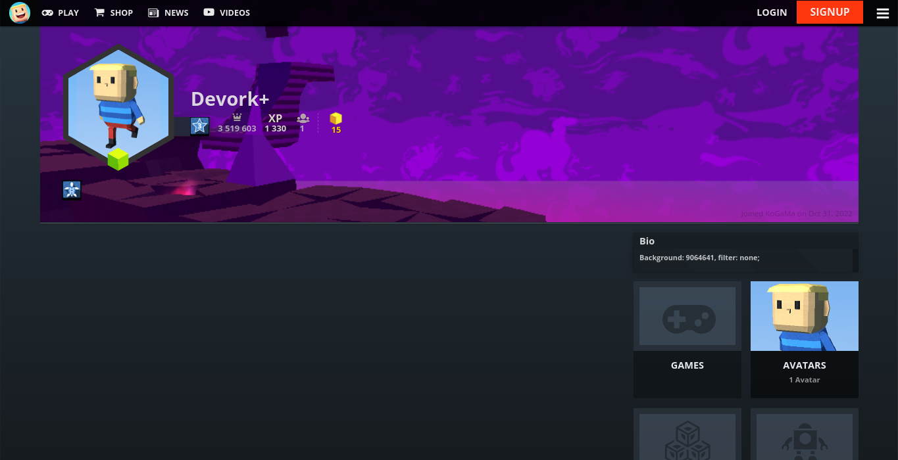
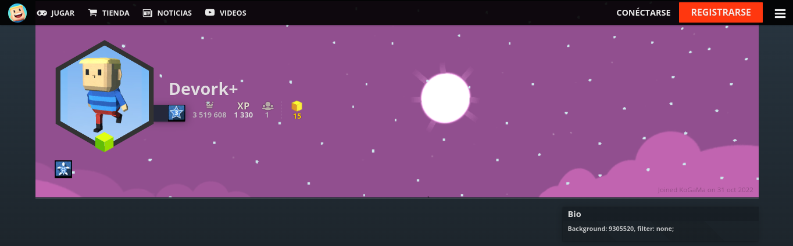
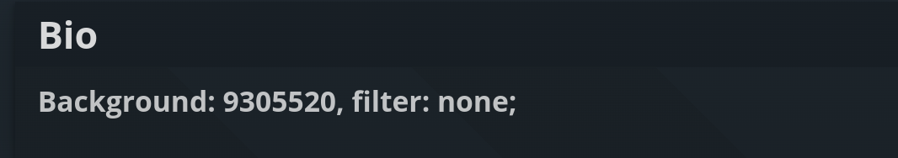

      
     <h1>Custom Profile Backgrounds for KoGaMa</h1>

# About
Custom profile background support. Showcase a game or create some profile art for all to enjoy at [KoGaMa](https://www.kogama.com)!

This idea was originally created by the [KoGaMa Buddy](https://programastudios.dev/projects/kogama-buddy/) team ([ProGraMa Studios](https://programastudios.dev/)), and recreated by me so that other users can enjoy this little snippet in a firefox or non-firefox browser.

# Screenshot
> 

# Getting Started
To set a custom profile background, include the following format somewhere in your profile description: 
<code>
      <b>Background:</b> <i>GAME_ID</i>, <b>filter:</b> <i>FILTER;</i>
</code>

+ **GAME_ID**: is the ID of a game on the current server.
+ **FILTER**: can be light, dark, blur, or none.

> Note: The format is case-sensitive, and filter is optional with a default value of light.

# Example
> 
> 