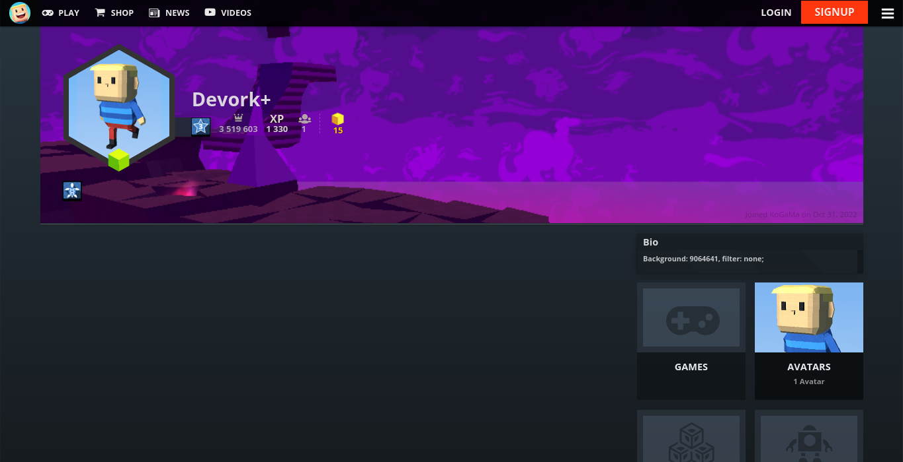
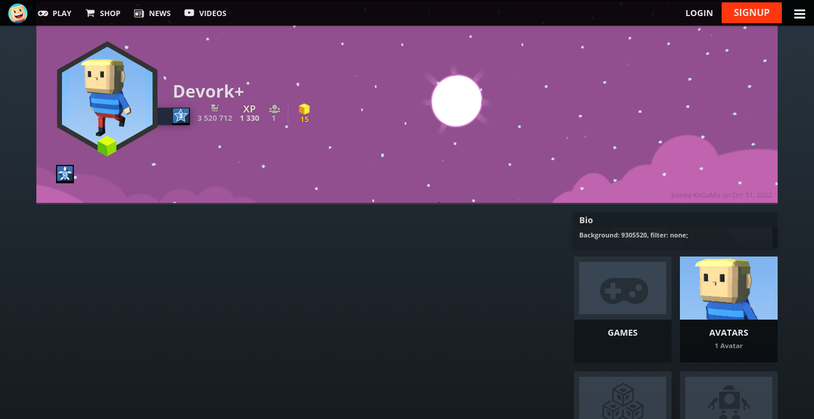
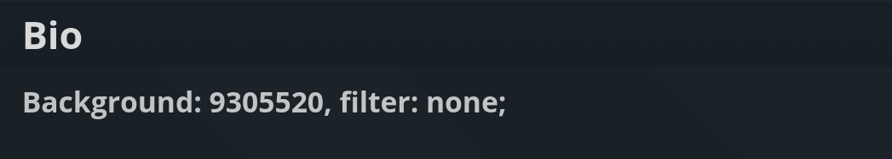

      
      <h1>Custom Profile Backgrounds v0.3</h1>

# About
Custom profile background support. Showcase a game or create some profile art for all to enjoy at [KoGaMa](https://www.kogama.com).

This idea was originally created by the [KoGaMa Buddy](https://programastudios.dev/projects/kogama-buddy/) or [ProGraMa Studios](https://programastudios.dev/), and re-created by me so, others users can enjoy this little tool on a non-firefox/firefox browser.

# Preview
> 

# Getting Started
To download this script you need a user-script manager, if you don't have, then check [InstallUserScriptsManager](https://github.com/Devorkk/InstallUserScriptsManager) guide. 
Otherwise, click the button below:

# Usage
To set a custom profile background, include the following format somewhere in your profile description: 
<code>
      <b>Background:</b> <i>GAME_ID</i>, <b>filter:</b> <i>FILTER;</i>
</code>

+ **GAME_ID**: is the ID of a game on the current server.
+ **FILTER**: can be light, dark, blur, or none.

> Note: The format is case-sensitive, and filter is optional with a default value of light.

# Example

